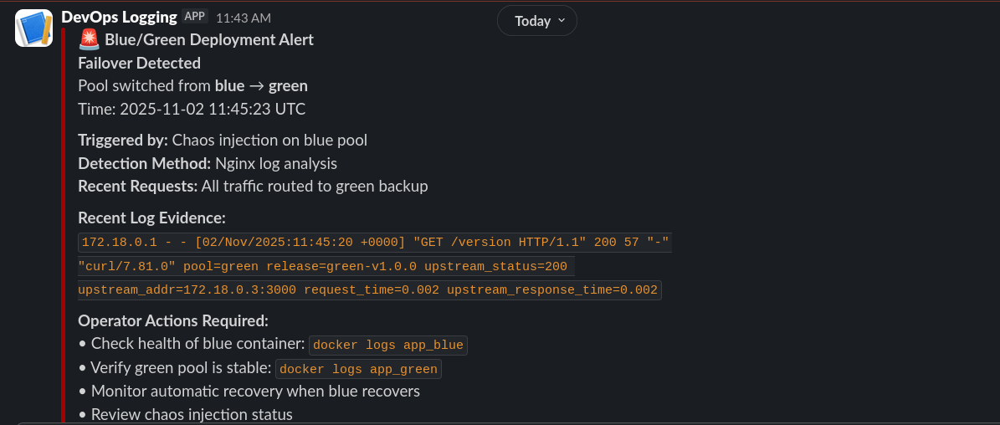
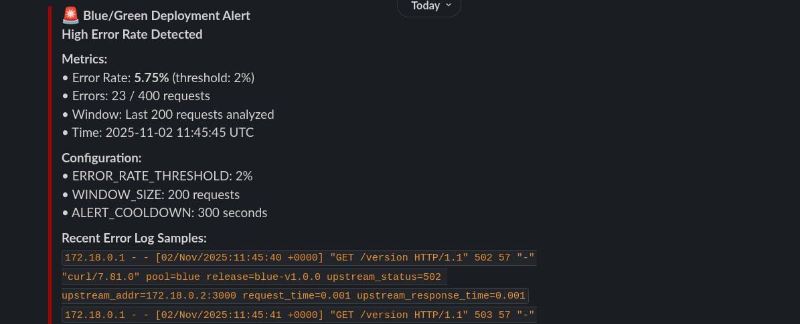
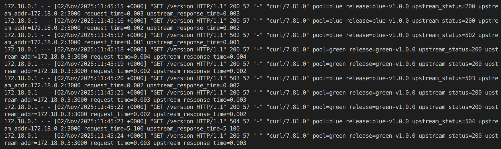

# Blue/Green Deployment with Nginx Auto-Failover + Observability

This project implements a Blue/Green deployment strategy for a Node.js application with:
- ✅ Automatic failover using Nginx
- ✅ Real-time log monitoring
- ✅ Slack alerts for failovers and errors
- ✅ Comprehensive runbook for operators

## 🏗️ Architecture
```
                    ┌─────────────────┐
                    │  Nginx Proxy    │
                    │  (Port 8080)    │
                    │  + Log Monitor  │
                    └────────┬────────┘
                             │
                    ┌────────┴────────┐
                    │                 │
           ┌────────▼────────┐ ┌─────▼──────────┐
           │  Blue App       │ │  Green App     │
           │  (Port 8081)    │ │  (Port 8082)   │
           │  Primary        │ │  Backup        │
           └─────────────────┘ └────────────────┘
                    │                 │
                    └────────┬────────┘
                             │
                    ┌────────▼────────┐
                    │  Alert Watcher  │
                    │  → Slack        │
                    └─────────────────┘
```

---

## 🚀 Quick Start

### Prerequisites

- Docker & Docker Compose
- Slack workspace (for alerts)

### 1. Clone Repository
```bash
git clone https://github.com/Reaganz-Wat/devops-blue-green.git
cd devops-blue-green
```

### 2. Configure Slack Webhook

1. Go to https://api.slack.com/messaging/webhooks
2. Create a new incoming webhook
3. Copy the webhook URL

### 3. Setup Environment
```bash
cp .env.example .env
# Edit .env and add your Slack webhook URL
nano .env
```

**Required:** Update `SLACK_WEBHOOK_URL` in `.env`

### 4. Start Services
```bash
docker-compose up -d
```

### 5. Verify Deployment
```bash
# Check all services are running
docker-compose ps

# Test the endpoint
curl -i http://localhost:8080/version
```

**Expected Response:**
```
HTTP/1.1 200 OK
X-App-Pool: blue
X-Release-Id: blue-v1.0.0
```

---

## 🧪 Testing & Verification

### Test 1: Baseline (Normal Operation)
```bash
# Send 20 requests - all should be 200 from Blue
for i in {1..20}; do
  curl -s http://localhost:8080/version | grep -o 'X-App-Pool: [a-z]*'
done
```

**Expected:** All responses show `X-App-Pool: blue`

---

### Test 2: Failover Detection + Slack Alert
```bash
# 1. Trigger chaos on Blue (simulates crash/errors)
curl -X POST "http://localhost:8081/chaos/start?mode=error"

# 2. Generate traffic to trigger failover
for i in {1..50}; do
  curl -s http://localhost:8080/version
  sleep 0.1
done

# 3. Check Slack for "Failover Detected" alert
# 4. Verify traffic switched to Green
curl -i http://localhost:8080/version | grep "X-App-Pool"
```

**Expected:**
- ✅ Slack alert: "Failover Detected: blue → green"
- ✅ All requests now show `X-App-Pool: green`
- ✅ Zero failed requests (all 200 OK)

**Screenshot Required:** Slack failover alert

---

### Test 3: High Error Rate Alert
```bash
# 1. Ensure Blue is active and in chaos mode
curl -X POST "http://localhost:8081/chaos/start?mode=error"

# 2. Generate enough traffic to exceed error threshold
for i in {1..300}; do
  curl -s http://localhost:8080/version > /dev/null
  sleep 0.05
done

# 3. Check Slack for "High Error Rate" alert
```

**Expected:**
- ✅ Slack alert: "High Error Rate Detected: X% (threshold: 2%)"

**Screenshot Required:** Slack error rate alert

---

### Test 4: Recovery
```bash
# 1. Stop chaos
curl -X POST http://localhost:8081/chaos/stop

# 2. Wait 30-60 seconds for Blue to recover

# 3. Generate traffic
for i in {1..50}; do
  curl -s http://localhost:8080/version
  sleep 0.2
done

# 4. Traffic should return to Blue automatically
curl -i http://localhost:8080/version | grep "X-App-Pool"
```

**Expected:**
- ✅ Requests return to `X-App-Pool: blue`
- ✅ Possible "Service Recovery" alert in Slack

---

### Test 5: Verify Nginx Logs
```bash
# View detailed Nginx logs with pool, status, upstream info
docker logs nginx_proxy 2>&1 | tail -10
```

**Expected Log Format:**
```
192.168.1.1 - - [01/Nov/2025:10:30:45 +0000] "GET /version HTTP/1.1" 200 156 
pool=blue release=blue-v1.0.0 upstream_status=200 upstream_addr=172.18.0.2:3000 
request_time=0.015 upstream_response_time=0.012
```

**Screenshot Required:** Nginx log showing structured fields

---

## 📊 Monitoring

### View Watcher Logs
```bash
docker logs -f alert_watcher
```

### View Nginx Logs
```bash
docker logs -f nginx_proxy
```

### View Application Logs
```bash
# Blue
docker logs -f app_blue

# Green
docker logs -f app_green
```

---

## ⚙️ Configuration

### Environment Variables (.env)

| Variable | Default | Description |
|----------|---------|-------------|
| **Stage 2** |||
| `BLUE_IMAGE` | (required) | Docker image for Blue app |
| `GREEN_IMAGE` | (required) | Docker image for Green app |
| `ACTIVE_POOL` | `blue` | Initial active pool |
| `RELEASE_ID_BLUE` | `blue-v1.0.0` | Blue release identifier |
| `RELEASE_ID_GREEN` | `green-v1.0.0` | Green release identifier |
| **Stage 3** |||
| `SLACK_WEBHOOK_URL` | (required) | Slack webhook for alerts |
| `ERROR_RATE_THRESHOLD` | `2` | Error % to trigger alert |
| `WINDOW_SIZE` | `200` | Requests in sliding window |
| `ALERT_COOLDOWN_SEC` | `300` | Seconds between alerts |
| `MAINTENANCE_MODE` | `false` | Suppress alerts when `true` |

### Adjusting Sensitivity

**More alerts (sensitive):**
```bash
ERROR_RATE_THRESHOLD=1
WINDOW_SIZE=100
```

**Fewer alerts (relaxed):**
```bash
ERROR_RATE_THRESHOLD=5
WINDOW_SIZE=500
```

---

## 📖 Runbook

See [runbook.md](runbook.md) for detailed operator procedures:
- Alert response actions
- Troubleshooting steps
- Manual testing procedures
- Emergency procedures

---

## 🛠️ Maintenance Mode

Suppress alerts during planned changes:
```bash
# Enable maintenance mode
echo "MAINTENANCE_MODE=true" >> .env
docker-compose restart alert_watcher

# Perform maintenance...

# Disable maintenance mode
sed -i 's/MAINTENANCE_MODE=true/MAINTENANCE_MODE=false/' .env
docker-compose restart alert_watcher
```

---

## 🧹 Cleanup
```bash
# Stop all services
docker-compose down

# Remove volumes (including logs)
docker-compose down -v

# Remove images
docker rmi yimikaade/wonderful:devops-stage-two
```

---

## 📸 Screenshots (Required for Submission)

### 1. Slack Failover Alert


**Must show:**
- Alert title: "Failover Detected"
- Pool transition: blue → green
- Timestamp
- Action items

### 2. Slack Error Rate Alert


**Must show:**
- Alert title: "High Error Rate Detected"
- Error percentage and threshold
- Error count and window size
- Timestamp

### 3. Nginx Structured Logs


**Must show:**
- `pool=` field
- `release=` field
- `upstream_status=` field
- `upstream_addr=` field
- `request_time=` field

---

## 🐛 Troubleshooting

### Alerts not appearing in Slack
```bash
# Check watcher logs
docker logs alert_watcher

# Verify webhook
curl -X POST $SLACK_WEBHOOK_URL \
  -H 'Content-Type: application/json' \
  -d '{"text":"Test from runbook"}'

# Restart watcher
docker-compose restart alert_watcher
```

### Watcher not detecting failover
```bash
# Check if logs are being written
docker exec nginx_proxy cat /var/log/nginx/access.log | tail -5

# Verify log format
docker logs nginx_proxy | grep "pool="

# Restart watcher
docker-compose restart alert_watcher
```

### Container health issues
```bash
# Check health status
docker-compose ps

# Check logs
docker logs app_blue
docker logs app_green

# Restart unhealthy container
docker-compose restart app_blue
```

---

## 📚 Project Structure
```
.
├── docker-compose.yml          # Service orchestration
├── nginx.conf.template         # Nginx config with logging
├── Dockerfile.watcher          # Watcher container
├── watcher.py                  # Python log monitoring script
├── requirements.txt            # Python dependencies
├── .env                        # Configuration (not in repo)
├── .env.example                # Example configuration
├── runbook.md                  # Operator runbook
├── README.md                   # This file
└── screenshots/                # Verification screenshots
    ├── slack-failover.png
    ├── slack-error-rate.png
    └── nginx-logs.png
```
